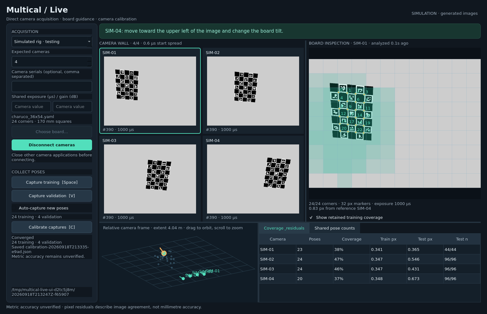

Multical Live is a standalone Qt interface for direct FLIR acquisition, visual board feedback, retained coverage, and background calibration. It does not require Captury, exported video, or an image import step.

For synchronized colour video capture, see [Live recording](LIVE_RECORDING.md).

The operator guide shows live corner counts on camera previews, selected-camera advice, saved-pose confirmation, and a **Capture walkthrough**. **Inspect camera needing poses** selects the camera with the fewest varied training views (breaking ties by image coverage); clicking a metrics row also selects that camera. The progress strip reports cameras with 12 varied views (3 with a seed), connected camera groups from retained shared detections, and cameras with validation views. Hover over it to see group membership. These are capture-planning indicators, not accuracy acceptance gates: pose initialization can still reject observations, and graph connectivity does not measure conditioning. Validation requires another camera seeing the target; a validation-view count alone does not establish successful independent predictions. The next-step text reports consecutive-detection steadiness, which is a movement hint rather than a physical stillness guarantee.



Run from this worktree:

**Four-camera view** and **Auto-focus needed views** are enabled by default. The target is reconsidered every 10 seconds, prioritizing currently usable cameras with fewer retained varied views. Partner panes prioritize current co-visibility across disconnected groups, other currently shared views, then previously observed overlaps. Unproven pairs are explicitly labelled **Scout: overlap not established**; serial numbers are never treated as physical neighbours. Pane assignments stay stable for 10 seconds. Clicking a camera or a metrics row disables auto-focus and pins the target; re-enable the checkbox to resume automatic selection. Switch off Four-camera view for one enlarged image. Each pane supports zoom/pan and shows detected corners and retained coverage.

To continue the same collection after closing the old viewer, pass `--resume live-sessions/SESSION_DIRECTORY` with the same board, source type, roster and capture mode. Resume validates the saved session and image files, rebuilds coverage from saved images, and continues capture numbering without overwriting existing captures. Do not run two writers against one session. Supply the same `--seed` if the original session was seeded. This resumes collection; it does not automatically load a previous fitted result.

```bash
./run-live --demo --auto-capture
```

The simulator renders ChArUco images through the real detector and changes its held pose every 1.8 seconds. It is explicitly labelled in the UI, session manifest, and calibration output. It is for exercising acquisition, detection, retention, visualization, and fitting; its results are not hardware validation.

An existing Captury calibration can seed the live geometry and lens parameters. Convert its `.calib` file once, then pass `--seed seed.json` or use **Load calibration seed…** before connecting. With only validation captures, **Calibrate captures** checks the seed without changing it; with training captures it refines extrinsics while retaining the imported lenses and world anchor. The complete format mapping, commands, validation evidence, and COLMAP/4C4D conversion requirements are in [CALIBRATION_INTEROP.md](CALIBRATION_INTEROP.md). Direct acquisition remains independent of Captury.

For the physical rig, close applications holding the cameras and run:

```bash
./run-live --count 25 --boards example_boards/charuco_36x54.yaml
```

**Stationary board** is the default capture mode. Hold the board still during each capture; different fixed exposure times are allowed. Leave exposure/gain overrides blank to preserve each camera's settings. If needed, enter overrides before clicking **Connect cameras**. Acquisition freezes exposure/gain auto modes, uses PTP and scheduled Action0 commands on each populated interface, and restores readable changed settings when disconnected. `ActionDeviceKey` is write-only on this fleet: its previous value cannot be backed up, so the adapter uses the documented Captury/CaptureNet key 42 and leaves that key in place. The interface does not provision PTP; that remains the job of CaptureNet. The native recorder temporarily applies the measured fleet transport profile (125 MB/s device limit and zero inter-packet delay), preserves packet size, and restores readable settings on disconnect. The PySpin fallback leaves those transport settings unchanged.

An explicit expected roster is preferable once camera serials are known:

```bash
./run-live --count 3 --serials SERIAL_A SERIAL_B SERIAL_C
```

With only a count, discovery must find exactly that number and the discovered roster is frozen in the session. With serials, every requested serial must be present; other discovered cameras are not acquired. Both modes reject missing/incomplete images, repeated IDs, invalid image data, and stale frames that miss the scheduled action by more than 1 ms. Exposure is subtracted from the camera's documented end-of-exposure timestamp when checking frame freshness.

In **Stationary board** mode, exposure-length differences, microsecond start/midpoint spread, and PTP clock-quality warnings do not block connection or capture. Timing diagnostics remain available in the camera-wall tooltip and are saved with retained captures. They do not replace board guidance with clock warnings. Manual capture relies on the operator holding the board still; auto-capture retains its existing image-motion check. Sessions and captures record the selected mode.

Select **Moving board · strict timing**, or pass `--capture-mode motion`, to restore the stricter timing policy: require PTP Slave within 1000 ns at connection, and reject captures with PTP warnings or start/midpoint spread above 20 µs. During acquisition, clock-quality warnings block retention while previews continue. SDK communication failures still stop acquisition in either mode. These are acquisition tolerances, not metrology acceptance thresholds.

The native recorder build and dependencies are described in [Live recording](LIVE_RECORDING.md). The following Python SDK notes apply to the PySpin fallback. The launcher uses this checkout's virtualenv, or the main worktree's virtualenv. The existing local virtualenv includes Qt, OpenCV, and SciPy. On another installation, install the package's `live` extra and the vendor's matching Spinnaker Python SDK. `multical-live` is also registered as a package entry point. PySpin is imported only when hardware acquisition starts. A user-installed PySpin is discovered automatically; alternatively pass `--sdk-path /path/to/site-packages`. The SDK must match the running Python ABI. The hardware adapter uses the installed SDK's `ImageProcessor` conversion API.

Hardware bring-up on September 18, 2026 connected all 25 cameras and displayed their native grayscale previews on the desktop. It exposed and fixed the write-only action-key access and the installed SDK's `SPINNAKER_COLOR_PROCESSING_ALGORITHM_HQ_LINEAR` constant. With `--exposure-us 1400`, read-back exposures were 1397–1399 µs, observed start spread was approximately 6–7 µs, complete sets contained all 25 frames, and the ChArUco detector reported a usable view. Actual acquisition was approximately 2–2.3 sets/s with a requested 5 Hz; throughput still needs profiling. The initial strict policy rejected intermittent master-offset excursions. The operator then confirmed the board would be held still, so stationary mode became the default and the shared-exposure override was removed. No calibration solve or accuracy acceptance was performed. The automated suite passed 37 tests, including stationary-versus-motion acceptance, retained warning metadata, frame-integrity checks, write-only node access, and PTP-warning recovery.

**Use the visualizer to drive collection.** The camera wall displays the newest acquired frames. Select a camera to inspect a full-resolution detection result, with corner IDs and an analysis-age label. The inspection image and overlays always come from the same frame. Scroll to zoom, drag to pan, and double-click to reset. The green grid counts distinct retained training poses per image cell; repeated stationary frames do not inflate the counts. The overlap matrix counts shared retained poses when at least one camera adds novel image geometry. This is a geometric-diversity heuristic, not an information matrix.

Capture training poses with **Space**, and reserve independent validation poses with **V**. Auto-capture retains only training poses that add projected-board geometry and have consecutive detections moving less than one pixel. Manual capture can retain repeated training observations; it never bypasses frame-integrity, the selected timing policy, or board-usability checks. A queued validation capture waits until the board leaves previously retained training poses. Training also avoids reserved validation poses. This image-space duplicate check reduces leakage but does not replace an independently captured validation session or surveyed reference.

Click **Calibrate captures** or press **C** after collecting at least 12 usable views per camera. The solve runs in a separate process while previews and collection continue. It uses a frozen snapshot: later captures belong to the next solve. You can cancel the process without disconnecting cameras. The fit:

- Fits standard intrinsics from the selected training images without residual-based view deletion or a relaxed RMS target.
- Requires a connected camera co-visibility graph and initialization for every training frame and camera.
- Fixes the first camera pose and the single board transform to remove coordinate gauges.
- Optimizes camera and frame poses with fixed intrinsics and board geometry, using a soft-L1 loss and no corner deletion.
- Reports residuals over all retained training detections, including the robustly downweighted ones.
- Evaluates validation views by estimating board pose in a different camera and predicting the withheld camera, with no validation residual filtering. Missing predictions count as failed points.

The relative rig view appears after a solve. Drag to orbit and scroll to zoom. Camera centres and optical directions are in metres in the first camera's coordinate frame; the grid is a coordinate aid, not a surveyed ground plane. Blue points are training target origins. The live target and amber predicted corners are estimated using the currently best-covered reference camera. The reference camera's own residual is a pose-fit diagnostic, not independent validation. Other cameras are predicted from that reference. The metrics table separately displays the frozen solve's training and validation residuals; `Test n` is evaluated / expected detected points. New live coverage can exceed the solve snapshot's coverage.

Results remain **metric accuracy unverified**, even if the optimizer converges and pixel errors are low. The UI currently implements acquisition and image-consistency diagnostics. It does not implement surveyed scale checks, a physical-board uncertainty budget, full geometric conditioning/covariance, or certification of sub-millimetre camera positions. Twelve views is an execution floor, not a sufficiency claim. The actual 25-camera rig needs a capture route with varied board position, depth and normal, image-edge observations, and redundant cross-volume links. Large distances and foreshortened targets can require a different measured target.

Each connection creates a new directory under `live-sessions/` (override with `--output`). It contains the exact board YAML and its SHA-256 hash, camera serials, software versions, capture roles, frame IDs/timestamps/exposure/gain/image sizes, camera ROI offsets and source pixel format, lossless grayscale PNGs, and detected corner IDs/coordinates. The grayscale images are copied from SDK buffers before those buffers are released. Capture directories are staged and the manifest is atomically replaced only after successful writes. Memory retains detections and bounded current images, rather than loading the entire image dataset.

Calibration JSON files are versioned and record exact training/validation capture IDs, intrinsics, world-to-camera transforms, frame poses, per-camera residuals/counts, solver termination diagnostics, and an unverified accuracy status. Camera centres are `-R.T @ t`. This interface's calibration JSON is a documented live-session result schema, not a drop-in replacement for every downstream calibration format. Original images and manifest remain available for reprocessing and independent checks.

The current interface supports one ChArUco board and standard pinhole distortion. Multiple independently moving boards, multi-face targets, distortion-model selection, hardware throughput qualification at 25 cameras, and external metrology acceptance remain further work. Acquisition and detection rates are separate: `--fps` controls scheduled acquisition (default 5 Hz), and `--workers` controls detector threads. If detection falls behind, intermediate preview frames are skipped for analysis instead of queued indefinitely. Disk writes can slow analysis/retention while acquisition continues.

Run the automated checks from the worktree with its Python environment:

```bash
../../.venv/bin/python -m unittest discover -s tests -v
QT_QPA_PLATFORM=offscreen ./run-live --demo --auto-capture \
  --output /tmp/multical-ui-check --run-seconds 8 --screenshot /tmp/multical-live.png
QT_QPA_PLATFORM=offscreen ../../.venv/bin/python tests/live_ui_smoke.py
```

The unit/integration suite covers dropped and stale frames, exposure midpoint mismatches, SDK buffer lifetime, graph mutation, gauge anchoring, the ChArUco grid check, empty error reporting, intrinsic-fit provenance, session persistence, a complete solve from rendered images, and a validation failure induced by perturbing camera translation. The longer UI smoke test exercises automatic collection, separate validation capture, background calibration, live preview continuity, saving, and shutdown. Hardware calls require a separate test with the real rig; simulation cannot establish device behavior or throughput.

CaptureNet-derived behavior is attributed in `multical/live/sources.py` to `/home/zerospace/capturenet/scripts/fire3.py`: scheduled Action0 keys, multi-interface broadcasts, PTP checks, and the end-of-exposure timestamp convention. No CaptureNet script is executed by this application.

Auto-capture has no fixed cooldown: each newly useful, steady observation is eligible as soon as detection finishes. Capture validity, duplicate-pose checks and training/validation separation still apply. Image saving remains synchronous with analysis, so actual capture throughput depends on acquisition, detection and disk writes. Validation may be captured manually or with auto-capture set to Validation.

Session controls are above the camera wall:

- **Pause capture / Resume capture** stops both automatic and manual training/validation retention while acquisition and detection continue. Queued capture requests are cancelled; a disk save already underway may finish. Calibration can still run while capture is paused.
- **Save calibration as…** exports the currently fitted or loaded calibration JSON. It is enabled only when a calibration exists. Completed solves are also saved automatically inside the session; captured images and metadata are always saved incrementally.
- **New calibration** starts a fresh collection with the current board and camera settings and no calibration seed. The prior session remains on disk.
- **Open saved session…** selects a session directory and restores its board, camera roster, source type, capture mode, captures and coverage. A saved bootstrap calibration is restored when present. This resumes collection, not a previous fitted-result display.
- **Load calibration…** accepts a live/multical/converted-Captury calibration JSON and starts a fresh session using it as a seed. It preserves the previous session and checks camera identity and image geometry before using the seed. Use Open saved session to recover captured poses instead.

New/open/load wait for acquisition to stop and camera settings to restore before reconnecting. The current auto-capture preference is retained; the new/resumed collection is unpaused. Pausing is the immediate way to take a break without disconnecting the cameras.

The compact interface uses neutral charcoal surfaces and no title banner. Camera settings are in a collapsed drawer; session actions use short labels with standard icons. Detailed guidance is available in tooltips and Help. The live status row summarizes view counts, connectivity and detection steadiness. Corner IDs are off by default and can be enabled beside Coverage. The empty rig panel is hidden until a calibration is loaded or fitted, and the preview area receives most of the initial vertical space. Pane dividers remain adjustable.

**Load calibration…** now also imports native Captury `.calib` files directly. Connect the full camera roster first: live native resolution and MAC addresses are required to resolve Captury identities safely. No intermediate conversion command is needed. The importer preserves the source file and starts a separate seeded session; use validation captures to assess it before refinement. JSON imports remain available.

The selector below **Auto-capture** chooses **Training** or **Validation**. Automatic validation requires at least two usable camera detections, consecutive steadiness, new validation coverage, and no overlap with retained training poses. It does not fit the seed or convert training records into validation. Pause applies to both roles. Manual Space/V retain their fixed roles. CLI: `--auto-capture --auto-capture-role validation`.

Click the **speaker icon** to mute or unmute short confirmation tones: one tone for a saved training pose, two rising tones for a saved validation pose. The adjacent dropdown arrow lists all seven cues; selecting one previews it even while muted, without changing the mute preference. The preference persists in `live-sessions/ui-preferences.ini`. Tones follow committed capture events, including manual captures; restored session history and unsaved detections do not produce sounds. Muting stops current playback, and muted events are not replayed when sound is re-enabled. Playback uses the desktop's selected audio output and runs independently of acquisition.

The speaker dropdown opens a labelled preview menu for seven cues: training saved, validation saved, attention (low falling tones), groups joined (rising chime), hold still (two short high tones), change tilt/position (up/down tones), and only one camera seeing the board (one low tone). Automatic cues obey mute; explicit menu previews always play. Attention reports capture-blocking frame/transport failures after one second, or a fatal engine error immediately; it sounds once per fault episode with a ten-second cooldown and one-second recovery debounce. Intentional pause, disconnect and session switching are silent. Stationary-mode timing advisories are not attention triggers.

Operator hints require two seconds of stable conditions, are at least twelve seconds apart, and are suppressed for three seconds after a committed capture. No board detections produce no hint. Hold still means usable detections are moving; change tilt/position means the current role already has this coverage. The milestone cue replaces the training-save tone only when retained training observations reduce the connected-group count; validation saves do not alter that graph. Existing restored history never emits milestone sounds. New sounds replace any playing cue rather than creating an audio backlog.

The world view colours cameras by validation evidence: grey means no varied validation poses, amber means captured but not evaluated, blue means independently evaluated, and red means evaluation had no successful predictions. Blue is not an accuracy pass. Hover a camera for its full serial, current varied-pose count and last evaluated RMS/count/failures; new validation captures automatically trigger background evaluation. Labels use the final four serial digits. Mint rings indicate a usable board detection now; arrows show each camera's optical forward direction. Click a camera to inspect it. The top-right reset button restores an isometric, fitted view and resets zoom.

With a loaded or fitted calibration, validation poses are evaluated automatically in a separate process. Only one calibration/evaluation worker runs at a time; poses arriving during a job are included in the next snapshot. Evaluation keeps camera parameters and training-fit metadata unchanged and uses only validation captures. Failed or cancelled snapshots are not retried until inputs change. Session-local `evaluation.json` is replaced atomically and restored on reconnect after checking the baseline calibration geometry, board hash and evaluated capture contents. Newer unevaluated captures trigger a follow-up job. Manual fitting still uses Calibrate.

Validation quality is displayed using provisional RMS review bands: below 3 px (blue), 3–8 px (amber), and at least 8 px (red). These are diagnostic bands, not physical-accuracy acceptance thresholds. The table separates RMS/P95 from checked/expected corners, current varied validation poses, and independently checked poses. Hover includes maximum error and failed points. The summary reports point-weighted RMS, cameras with evidence, cameras at or above 3 px, and failed corners; failures are never folded into a falsely low RMS.
